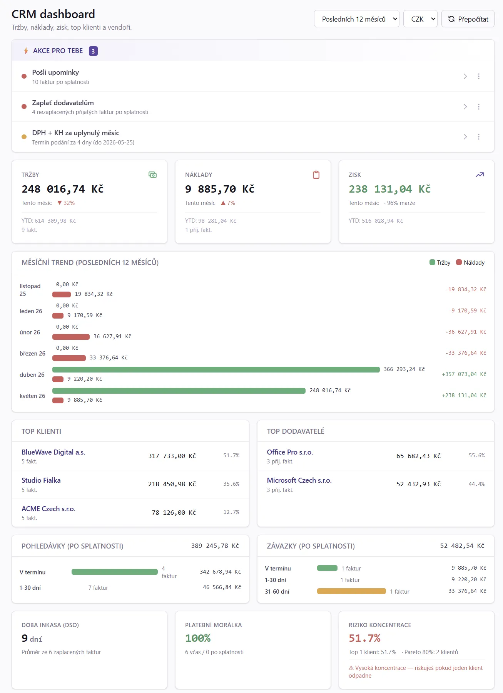

# MyInvoice.cz

[](LICENSE)
[](https://www.php.net/)
[](https://mariadb.org/)
[](https://vuejs.org/)
[](https://github.com/radekhulan/myinvoice/pkgs/container/myinvoice)
[](https://github.com/radekhulan/myinvoice/pkgs/container/myinvoice)

> **Český fakturační a účetní systém pro freelancery, OSVČ a malé firmy.**
> Vystavené i přijaté faktury, AI extrakce PDF, CRM dashboard, výkazy DPH /
> KH / SH a daň z příjmů (EPO XML), QR platby, výkaz víceprací,
> import bankovních výpisů, REST API, exporty pro účetní software — vše na vlastním serveru.

Vyvíjí **[MyWebdesign.cz s.r.o.](https://mywebdesign.cz/)**

🌐 **Projektový web: [MyInvoice.cz](https://myinvoice.cz/)**

📖 **Online dokumentace: [MyInvoice.cz/manual](https://myinvoice.cz/manual/)**

> ⚠️ **Než začneš fakturovat — přečti si [Fakturujeme — daňový průvodce](manual/06_Fakturujeme.md).**
> Vysvětluje, jak aplikace pracuje s plátci/neplátci DPH, sazbami, reverse charge,
> kde má aplikace limitace (OSS, SK 23 %) a jak je obejít. **Správnost faktury
> je vždy na uživateli — pro nestandardní situace konzultuj účetní.**


---

## Proč MyInvoice.cz?

Většina českých online fakturačních služeb je SaaS s měsíčními poplatky a vašimi
fakturačními daty mimo váš dosah. **MyInvoice.cz je open-source, self-hosted**
alternativa s důrazem na:

- **Tvoji databázi, tvoje data** — vše běží na vlastním (nebo pronajatém) serveru, žádný cloud.
- **Multi-supplier od první verze** — fakturuj za více firem / IČO z jedné instalace, snadný přepínač v UI.
- **Český kontext první** — ARES + VIES lookup, SPAYD QR (ČR) i SEPA EPC QR (EU),
  ISDOC + Pohoda XML exporty, mod-11 validace bankovních účtů, GPC import výpisů.
- **Nulové měsíční náklady** — jednorázový setup, žádné per-fakturové poplatky, žádné limity.

---

## Co umí

### 📄 Vystavené faktury
- 4 typy dokladů: **faktura**, **zálohová (proforma)**, **opravný daňový doklad** (dobropis), **interní storno**
- Vystavení daňového dokladu z proformy s automatickým **odečtem zaplacené zálohy**
- **Klonování faktur** s auto-inkrementem měsíce v popiscích (`3/2026 → 4/2026`)
- Hromadné akce: *Vystavit znovu (N)*, *Odeslat klientovi (N)*, *Označit jako zaplacené*, *Upomínka*
- **Výkaz víceprací** (work_report) jako 2. strana PDF s přenosem sumy do položky
- **Schvalování výkazu zákazníkem přes e-mailový odkaz** — volitelné per zakázka:
  zákazník dostane e-mail s odkazem na veřejnou stránku (token + CAPTCHA),
  jedním klikem schválí/zamítne, faktura se po schválení automaticky vystaví
  a odešle
- PDF se **snapshotem dodavatele/odběratele/banky** — vystavená faktura je neměnná
- Editace vystavené faktury jen pro admina s `?force=1` + audit záznam


### 📥 Přijaté faktury (nákupy) — od v4.0.0
- **Dodavatelé** jako role v tabulce klientů (`is_vendor=1`) — sdílená evidence, jedna firma může být K+D
- Status lifecycle: **draft → received → booked → paid** (+ cancelled), barevné UI badge
- **Multi-currency** (faktura v USD, platba v CZK) s kurzem ČNB + tracking *exchange_diff_base*
- Hromadné akce na konceptech: *Označit jako přijaté*, *Zaúčtovat*, *Označit zaplacené*, *Stornovat*, *Smazat*
- PDF archiv s SHA-256 dedupe + force-delete pro admina
- Filtr `?overdue=1` z dashboardu na nezaplacené po splatnosti
- **Export Pohoda XML / ISDOC ZIP / PDF ZIP** — analogicky vystaveným fakturám

### 🤖 Inteligentní import — od v4.0.0
- **AI extrakce PDF** přes Anthropic Claude (BYOK) — z naskenovaného PDF vytáhne dodavatele,
  IČ/DIČ, číslo dokladu, datumy, položky, sumy, IBAN, e-mail, telefon, web,
  detekce *"NEPLAŤTE, JIŽ UHRAZENO"* (auto-paid), rounding handling
- **ISDOC import** (PdfIsdocExtractor + parser) — strukturovaná XML data uvnitř PDF
- **Pohoda XML import** vystavených i přijatých faktur
- **iDoklad / Fakturoid synchronizace** — OAuth pull klientů + faktur + PDF příloh
- **Inbox scan** — sleduje konfigurovaný adresář, ISDOC priorita, AI fallback,
  rate limited (30 calls / 5 min / user), cron `cron-scan-purchase-inbox`
- **ClientResolver** — 3-úrovňový lookup (IČO → DIČ → exact company_name) brání duplikování dodavatelů

### 📊 CRM dashboard — od v4.0.0
- **KPI** — tržby / náklady / zisk per měsíc + YTD + trend % vs minulý měsíc
- **Akce pro tebe** — daily TODO (overdue faktury, recurring k vystavení, DPH deadline,
  neaktivní klienti) s dismiss per den / týden / navždy / **pro historická data**
  (snapshotuje aktuální ID, zobrazí jen NOVÉ výskyty — užitečné při migraci 2 roky zpět)
- **Aging** pohledávek i závazků (V termínu / 1-30 / 31-60 / 61-90 / 90+ dní)
- **DSO** (Days Sales Outstanding), platební morálka, riziko koncentrace (Pareto)
- **Cash flow forecast** 4 týdny dopředu, late-risk score per klient
- **Náklady po rocích / měsících**, expense breakdown podle kategorií, churn risk
- **Top klienti / Top dodavatelé** Pareto + percent_share



### 💳 Platby
- **QR platby** přímo v PDF: SPAYD pro CZK, SEPA EPC pro EUR
- **Import GPC** výpisů (ABO formát, KB / FIO / ČSOB / RB / ČS) s SHA256 dedupe
- **Auto-matching** transakcí na faktury podle VS + částky → automaticky `paid`
- Manuální párování + označení transakce jako "ignorovat"
- **Upomínky** po splatnosti — manuální tlačítko na detailu, hromadná akce, nebo cron


### 👥 Klienti, zakázky & dodavatelé
- Klienti s **ARES** (IČO → adresa, název) a **VIES** (DIČ) lookupem (+ fallback)
- **Dual-role firmy** — jeden řádek může být zároveň klient (K) i dodavatel (D)
- Zakázky 1:N pod klientem, fakturační emaily per zakázka (účetní, PM…)
- Filter zakázek podle klienta, vendors `?role=vendors` se sloupcem *Počet faktur*
- Reverse charge přepínatelný per klient
- Smazání chráněné 409, pokud má klient/zakázka navázané faktury

### 🏢 Multi-supplier
- Z jedné instalace fakturuj **za libovolný počet dodavatelů (firem / IČO)**
- Přepínač v horní liště, izolovaná data (klienti, zakázky, faktury, číselníky)
- Každý dodavatel má vlastní sadu měn + bankovních účtů, vlastní řadu varsymbolů
- Per-dodavatel: ARES údaje, logo, podpis, SMTP `From:` jméno + `Reply-To:` adresa, Pohoda kódy
- **AI BYOK** — Anthropic API key per dodavatel (volitelný), šifrovaný v DB

### 📦 Exporty pro účetní
- **Hromadný export PDF** (ZIP po měsících) — vystavených i přijatých
- **ISDOC 6.0.2** — český národní standard pro B2B výměnu faktur
- **Pohoda XML** (Stormware data package) — přímý import do Pohody bez ručního opisu
- Per-dodavatel konfigurace Pohoda kódů (středisko, činnost, předkontace, číselná řada)

### 🧾 Výkazy DPH a daň z příjmů — od v4.0.0
- **DPHDP3** — přiznání k DPH (měsíční / kvartální, s ohledem na is_vat_payer + financial_office_code)
- **DPHKH1** — Kontrolní hlášení (A.1-A.5, B.1-B.3, řádky 40-43, RC, dovoz)
- **DPHSHV** — Souhrnné hlášení (EU intracom dodávky)
- **DPFDP5** (OSVČ) a **DPPDP9** (právnické osoby) — daň z příjmů MVP foundation
- XML pro **EPO portál MFČR** + XSD validace přes `DOMDocument::schemaValidate`
- **Archiv podání** — každé generování XML s timestamp + summary + status

### 🔌 REST API v1 (public) — od v3.4.0
- **Personal Access Tokens** (PAT) přes Bearer Authorization
- 101 endpointů v `/api/v1/*` (vystavené + přijaté faktury, klienti, zakázky, CRM, výkazy, codebooks)
- **OpenAPI 3.1** spec v `api/openapi.yaml` + Swagger UI + Redoc
- Rate limit 600 req/min/token, X-RateLimit-* hlavičky
- Per-token scope (read-only / write), audit log

### 📧 Komunikace
- Odesílání faktur **e-mailem** (Symfony Mailer + DKIM podpora)
- **Editor e-mailových šablon** v UI (Twig) — CZ / EN, HTML + plaintext varianty
- Šablony: nová faktura, upomínka, reset hesla, test
- Per-dodavatel branding (`From:` jméno, `Reply-To:`)

### 🔒 Bezpečnost
- **CZ + EN lokalizace** UI i faktur
- **Brute-force ochrana** (Redis nebo MariaDB MEMORY fallback) — 5 selhání → CAPTCHA, 30/h → 24h lockout
- **Cloudflare Turnstile** CAPTCHA
- **IP allowlist** (IPv4 + IPv6 + CIDR)
- **CSRF** + Origin check, **TOTP 2FA** (volitelně vynucené pro všechny: `MYINVOICE_AUTH_REQUIRE_TOTP=true`)
- Peppered bcrypt hesla, **AES-256-GCM** šifrování citlivých polí (TOTP secret, AI keys)
- **RBAC** (admin / accountant / readonly)
- **Activity log** všech mutací (včetně IP)
- **Path-traversal guards** (Windows case-insensitive), XML sanitization, ZIP streaming
- **AI rate limit** 30 calls / 5 min / user — ochrana před BYOK billing rizikem

### 📊 Homepage
- KPI tiles ve 3 sekcích s barevným odlišením: **Vystavené** (purple), **Přijaté** (orange), **Pohledávky** (green)
- Top klienti — koláč letošního i loňského roku
- Obrat po měsících (line chart letos vs. minulý rok)
- Po splatnosti + nezaplacené faktury (s tlačítkem upomínka)
- Cash-flow forecast — co přiteče v příštích týdnech

### ⚙️ Admin: Cron jobs monitoring — od v4.0.0
- `/admin/cron-jobs` přehled všech cron skriptů s health badge (ok / overdue / failing)
- Last run / last OK / duration / status
- **Failed items list** — pro `cron-scan-purchase-inbox` se rozbalí seznam neimportovaných souborů s důvodem (path traversal, AI nedostupné, prázdný PDF, …)
- Manual *Spustit teď* tlačítko

---

## Quick start: Docker (3 minuty)

Nejrychlejší cesta k běžící aplikaci. Stačí mít nainstalovaný **Docker Desktop**
(Windows / macOS) nebo **Docker Engine + compose-plugin** (Linux) — nepotřebuješ
lokálně PHP, MariaDB, Node ani nic dalšího.

### Varianta A — one-click z GHCR ⭐ (nejsnazší)

Naklonuj repo a spusť jeden příkaz. Stáhne pre-built multi-arch image
(`ghcr.io/radekhulan/myinvoice:latest`, `linux/amd64` + `linux/arm64`),
vygeneruje hesla a configy, spustí stack a migrace. Nepotřebuješ na hostu
`pnpm`/`composer` ani několikaminutový build.

```bash
git clone https://github.com/radekhulan/myinvoice.git
cd myinvoice

# Linux / macOS
cmd/docker-ghcr.sh

# Windows PowerShell
.\cmd\docker-ghcr.ps1
```

> **WSL2 / Linux po klonu:** pokud `./cmd/docker-ghcr.sh` hlásí
> `Permission denied` nebo `/usr/bin/env: 'bash\r': No such file…`,
> má tvůj git zapnutý `core.autocrlf=true` (na checkoutu konvertuje LF → CRLF).
> Oprav jednorázově existující soubory a vypni autocrlf globálně:
>
> ```bash
> sed -i 's/\r$//' cmd/*.sh
> chmod +x cmd/*.sh
> git config --global core.autocrlf input
> ```
>
> Repo má `.gitattributes` s `*.sh text eol=lf`, takže příští `git clone`
> bude LF i bez tohoto kroku.

Skript automaticky:

1. Vygeneruje `.env` s náhodnými DB hesly (28 znaků base64)
2. Vygeneruje `cfg.docker.php` z `cfg.sample.php` (host=db / redis, randomized
   `app.pepper` + `secret_encryption_key`, dev-friendly cookies pro HTTP loopback)
3. `docker compose pull` — stáhne image z GHCR
4. Spustí stack: **app** (Apache:80→host:8080) + **db** (MariaDB 11)
5. Počká, až bude DB healthy, a spustí migrace

Používá `docker-compose.production.yml`, takže další compose příkazy vyžadují
flag `-f docker-compose.production.yml` (logs, pull, down…).

**Aktualizace na novou verzi** — stačí jeden příkaz:

```bash
# Linux / macOS
cmd/docker-update.sh

# Windows PowerShell
.\cmd\docker-update.ps1
```

Skript v registry módu sám zavolá `docker compose pull app` (stáhne nový image
z GHCR), restartuje stack a doběhne pending migrace. Volumes (DB data) zůstávají
zachovány. Nový image se publikuje automaticky při každém release tagu
`v*.*.*`.

> 🔔 **Upgrade přímo z UI (admin):** od **v3.0.0** aplikace denně kontroluje
> GitHub Releases API a v patičce zobrazí aktuální verzi + badge pokud je
> dostupná novější. Admin v **Systém → Aktualizace** vidí release notes a
> tlačítkem **„Aktualizovat"** zařadí upgrade do fronty. Vlastní pull image
> + restart provádí host-side proces `cmd/docker-update-watcher.(sh/ps1)` —
> viz **„Update watcher"** níže. Bez watcheru pořád funguje shell příkaz
> výše. Daily check ke svému běhu potřebuje cron
> `php api/bin/cron-version-check.php` (1× denně).

#### Update watcher — jednoclick upgrade z UI

Watcher je samostatný host-side proces, který sleduje flag soubor uvnitř
kontejneru (`docker compose exec -T app test -f storage/upgrade-requested.json`)
a když ho najde, spustí `cmd/docker-update.(sh/ps1)` — pull `:latest`
image, restart stacku, migrace. Výsledek zapíše zpět do kontejneru,
UI ho zobrazí jako „Upgrade úspěšně dokončen / selhal".

**Test ve foregroundu** (než ho udělej daemon):

```bash
# Linux / macOS
cd /opt/myinvoice && bash cmd/docker-update-watcher.sh
```

```powershell
# Windows
cd C:\inetpub\myinvoice
powershell -NoProfile -ExecutionPolicy Bypass -File cmd\docker-update-watcher.ps1
```

**Produkce — daemon (Linux):**

```bash
sudo tee /etc/systemd/system/myinvoice-update-watcher.service <<'EOF'
[Unit]
Description=MyInvoice update watcher
After=docker.service

[Service]
Type=simple
WorkingDirectory=/opt/myinvoice
ExecStart=/opt/myinvoice/cmd/docker-update-watcher.sh
Restart=always

[Install]
WantedBy=multi-user.target
EOF

sudo systemctl daemon-reload
sudo systemctl enable --now myinvoice-update-watcher
```

**Produkce — Scheduled Task (Windows):**

```powershell
schtasks /create /tn "MyInvoice Update Watcher" `
  /tr "powershell.exe -NoProfile -ExecutionPolicy Bypass -File C:\inetpub\myinvoice\cmd\docker-update-watcher.ps1" `
  /sc onstart /ru SYSTEM /rl HIGHEST
schtasks /run /tn "MyInvoice Update Watcher"
```

Detaily, recovery při zaseknutém upgradu a odlaďování v manuálu §
[21 Aktualizace](manual/21_Aktualizace.md).

### Varianta B — build z source (pro vývoj)

S klonem repa máš přístup k celému kódu, můžeš upravovat a build si vyrobí
lokálně místo stahování z GHCR:

```bash
git clone https://github.com/radekhulan/myinvoice.git
cd myinvoice

# Linux / macOS
cmd/docker-install.sh

# Windows PowerShell
.\cmd\docker-install.ps1
```

Stejné kroky jako Varianta A, jen místo `pull` z GHCR postaví `myinvoice:latest`
image lokálně (multi-stage: Vue build → composer → PHP 8.5 + Apache). Pomalejší,
ale zachytí tvoje rozpracované úpravy v repu.

### Varianta C — bez klonování repa (jen Docker, manuálně)

Pro produkční Linux server, kde nechceš mít ani klon repa. Stáhneš jen dva
soubory přes `curl` a sestavíš konfiguraci ručně:

```bash
mkdir myinvoice && cd myinvoice
curl -O https://raw.githubusercontent.com/radekhulan/myinvoice/master/docker-compose.production.yml
curl -O https://raw.githubusercontent.com/radekhulan/myinvoice/master/cfg.sample.php
mv docker-compose.production.yml docker-compose.yml
cp cfg.sample.php cfg.docker.php
# uprav cfg.docker.php — minimálně:
#   db.host => 'db', db.user => 'myinvoice', db.pass => '<heslo z .env níže>'
#   app.pepper a secret_encryption_key (oboje: openssl rand -base64 32)

cat > .env <<EOF
DB_PASSWORD=$(openssl rand -base64 28)
DB_ROOT_PASSWORD=$(openssl rand -base64 28)
EOF

docker compose up -d
```

> ⚠️ Tato varianta hesla a secrets do `cfg.docker.php` automaticky nedoplní —
> musíš je tam zapsat ručně (viz komentář v ukázce). Pro one-click použij
> **Variantu A**.

> 💡 V produkci pinuj konkrétní verzi — v `docker-compose.yml` (resp.
> `docker-compose.production.yml`) změň `:latest` na konkrétní tag, např.
> `:1.7.0`. Update pak `cmd/docker-update.{sh,ps1}` (auto-detekuje registry
> mode = `pull` + `up -d` + migrace).
>
> Od image **v3.1.0** se migrace pouští i automaticky při startu kontejneru
> (`docker-entrypoint.sh`), takže nová DB se inicializuje sama.

> 📖 **Manuál na `/manual`:** GHCR image má od **v2.1.5** vygenerovaný HTML
> manuál a od **v2.3.0** i PDF (`tools/generateManualHtml.php` +
> `tools/exportManualToPdf.php` se volají build-time v `Dockerfile`),
> takže `http://localhost:8080/manual` funguje bez dalších kroků a v sidebaru
> je button **„Stáhnout PDF"**. Update na nový obsah = `cmd/docker-update.{sh,ps1}`
> (pull novějšího image).
>
> Kdyby `/manual` vrátil 503 *„Manuál není zatím vygenerovaný“*: pokud
> jedeš na starém image před v2.1.5, `cmd/docker-update.{sh,ps1}` (pull
> nového GHCR image) je řešení — staré image neměly `manual/*.md` uvnitř
> vůbec. Na v2.1.5+ image regeneruješ manuál ručně bez rebuildu:
>
> ```bash
> docker compose -f docker-compose.production.yml exec app \
>   php tools/generateManualHtml.php
> docker compose -f docker-compose.production.yml exec app \
>   php tools/exportManualToPdf.php
> ```

### Po dokončení (všechny varianty)

**Otevři: 👉 [http://localhost:8080](http://localhost:8080)**

V prohlížeči naskočí **setup wizard** (3 kroky):

1. **Administrátor** — jméno, e-mail, heslo (min. 12 znaků)
2. **Dodavatel** — IČO → *Načíst z ARES* → bankovní účet (např. `1000000005 / 0100`)
3. **Sample data** *(volitelné)* — checkboxem 5 klientů + 8 zakázek + 20 faktur + 4 dobropisy

Wizard tě po dokončení **automaticky přihlásí**.

### Další port než 8080?

Edituj `.env` (vznikl po prvním spuštění install skriptu):

```bash
APP_PORT=9000              # místo 8080
DB_PORT=3308               # místo 3307 (vázán jen na 127.0.0.1)
```

a `docker compose up -d`. URL pak bude `http://localhost:9000`.

### Env proměnné pro auto-migrace (Docker runtime)

```bash
MYINVOICE_SKIP_MIGRATIONS=1     # vypne auto-migraci při startu
MYINVOICE_MIGRATE_ATTEMPTS=20   # počet retry pokusů migrace
MYINVOICE_MIGRATE_DELAY=3       # pauza mezi pokusy (sekundy)
MYINVOICE_DATA_DIR=/data        # v3.6.0+ default v compose souborech (single-volume layout)
MYINVOICE_AUTH_REQUIRE_TOTP=true # v3.3.0+ — vynutit 2FA pro všechny uživatele (default false)
```

Od image **v3.1.0** se migrace pouští při startu kontejneru automaticky
(`docker-entrypoint.sh`). Ruční `php api/bin/migrate.php` je stále bezpečný
idempotentní fallback.

Od **v3.6.0** je `MYINVOICE_DATA_DIR=/data` default v `docker-compose.yml` i
`docker-compose.production.yml` — všechen stateful obsah (log/, storage/,
private/dkim/, **i `cfg.local.php`**) leží v jediném `app-data:/data` volumu.
Per-instance konfigurace ze setup wizardu tak přežije image update.

Image obsahuje stub `cfg.php`, takže bind-mount `cfg.docker.php` je volitelný —
pro full-ENV deploy ho lze vynechat.

**Upgrade z 3.5.x a starší (3-volume layout):** `cmd/docker-update.{sh,ps1}`
detekuje staré volumes (`app-log`, `app-storage`, `app-private`) a před `up -d`
automaticky spustí `cmd/docker-migrate-volumes.{sh,ps1}` — zkopíruje data
i `cfg.local.php` ze starého layoutu do `app-data`. Staré volumes nemaže
(úklid příkazy vypíše).

### Railway / PaaS env placeholdery

Od v3.1.0 aplikace v env overridech ignoruje nevyřešené placeholdery ve tvaru
`${VAR}` (typicky Railway, když proměnná není definovaná), takže nepřepíšou
validní hodnoty z `cfg.php` / `cfg.docker.php`.

### Daily ops

```bash
docker compose up -d                                 # start
docker compose down                                  # stop (data v named volumes přežijí)
docker compose down -v                               # stop + WIPE volumes (ZNIČÍ DB!)
docker compose logs -f app                           # live logs
docker compose exec app bash                         # shell do kontejneru
docker compose exec app php api/bin/migrate.php      # CLI uvnitř kontejneru
cmd/docker-build.sh --no-cache                       # rebuild image (po PHP/JS změnách)
```

### Po setupu si edituj `cfg.docker.php`

Install skript nastaví minimum potřebné k běhu, ale tyto věci si musíš doplnit ručně:

- `smtp.*` — odchozí pošta (jinak nepůjdou faktury / upomínky / reset hesla)
- `captcha.site_key` + `captcha.secret_key` — z [dash.cloudflare.com → Turnstile](https://dash.cloudflare.com)
- `ip_allowlist.allow` — volitelné, doporučeno mimo lokál

Po editaci stačí `docker compose restart app` (cfg je bind-mountovaný — žádný rebuild).

### Volitelný Redis

```bash
docker compose --profile redis up -d
```

a v `cfg.docker.php` nastav `redis.enabled => true` (host už je `redis`). Restart appky.

Více detailů (cron uvnitř kontejneru, `.env` proměnné, troubleshooting): viz [`cmd/README.md`](cmd/README.md).

---

## Setup bez Dockeru (native, 5 minut)

Pokud nechceš Docker (např. cílový deploy je IIS / Apache na holém železe).

### Předpoklady

- **PHP 8.5+** s extensions: `pdo`, `pdo_mysql`, `mbstring`, `openssl`, `json`, `iconv`, `gd`
- **MariaDB 10.6+** (doporučeno 11.x)
- **Composer 2.x**, **Node.js 22+**, **pnpm 10+**
- **Redis** (volitelné — fallback na MariaDB MEMORY)
- Web server: **IIS** nebo **Apache** (oba podporované, repo má `web.config` i `.htaccess`)

### 1. Klon a konfigurace

```bash
git clone https://github.com/radekhulan/myinvoice.git myinvoice
cd myinvoice
cp cfg.sample.php cfg.php
```

Otevři `cfg.php` a vyplň:

- `db.user` / `db.pass` — připojení k MariaDB
- `app.pepper` — vygeneruj `openssl rand -base64 32`
- `smtp.host` / `user` / `pass` — odchozí pošta
- `captcha.site_key` / `secret_key` — z [dash.cloudflare.com → Turnstile](https://dash.cloudflare.com)
- `ip_allowlist.allow` — volitelné, doporučeno v produkci

### 2. Vytvoř databázi

```bash
mysql -u root -p -e "CREATE DATABASE myinvoice CHARACTER SET utf8mb4 COLLATE utf8mb4_unicode_ci;"
```

### 3. Nainstaluj backend a spusť migrace

```bash
cd api && composer install && cd ..
php api/bin/migrate.php
php tools/generateManualHtml.php   # vyrenderuje manual/generated/ → /manual route
php tools/exportManualToPdf.php    # vygeneruje manual/manual.pdf (Stáhnout PDF v sidebaru)
```

> `generateManualHtml.php` je self-contained (nepotřebuje composer/vendor),
> generuje HTML kapitoly + search index. `exportManualToPdf.php` vyžaduje
> `api/vendor/` (mPDF). Spouštět znovu po každém pull repa, aby `/manual`
> ukazoval aktuální obsah. (V Docker variantě se obě volají build-time
> uvnitř `Dockerfile`.)

### 4. Frontend

```bash
cd web
pnpm install
pnpm build       # produkční build do web/dist/
# nebo pro vývoj:
pnpm dev         # dev server na :5173
```

### 5. Otevři prohlížeč → setup wizard

V prohlížeči navštiv `https://tvoje-domena.cz` (nebo `http://localhost:5173` v devu)
a projdi **3 kroky setup wizardu**:

1. **Administrátor** — jméno, e-mail, heslo (min. 12 znaků, indikátor síly)
2. **Dodavatel** — vyplň IČO a klikni *Načíst z ARES* (předvyplní název, adresu,
   DIČ); doplň první bankovní účet (CZK)
3. **Sample data** *(volitelné)* — checkboxem si necháš vygenerovat 5 klientů,
   8 zakázek, 20 faktur a 4 dobropisy pro vyzkoušení systému

Po dokončení tě wizard **automaticky přihlásí** a přesměruje do aplikace.

### Další dodavatelé

V menu **Systém → Dodavatelé** klikni *Nový dodavatel*. Stačí zadat IČO → ARES doplní
zbytek. V horní liště se objeví přepínač pro snadné přepínání mezi firmami.

### Aktualizace nativní instalace

Klasická cesta (vyžaduje Composer + Node + pnpm na hostu):

```bash
git fetch --tags
git checkout vX.Y.Z
cd api && composer install --no-dev && cd ..
cd web && pnpm install && pnpm build && cd ..
php tools/generateManualHtml.php
php tools/exportManualToPdf.php
php api/bin/migrate.php
```

Bez Composeru / Node (sdílený hosting) — stáhni **production bundle** z release
page (od **v3.0.0** se publikuje automaticky při tagu):

```bash
TAG=3.0.0
curl -LO https://github.com/radekhulan/myinvoice/releases/download/v$TAG/myinvoice-$TAG.tar.gz
sha256sum -c myinvoice-$TAG.tar.gz.sha256   # ověř integritu
tar -xzf myinvoice-$TAG.tar.gz --strip-components=1 \
  --exclude='cfg.php' --exclude='cfg.local.php' \
  --exclude='storage' --exclude='private' --exclude='log'
php api/bin/migrate.php
```

Bundle obsahuje hotové `api/vendor/`, `web/dist/`, `manual/generated/` i
`manual.pdf`, takže žádný build krok není potřeba.

> 🔔 **Upgrade z UI (admin):** v **Systém → Aktualizace** je tlačítko
> *Aktualizovat*, které ti tyto příkazy zobrazí jako copy-paste box (Phase 2
> doplní automatický download + extrakci). Footer aplikace zobrazuje
> aktuální verzi + badge pokud je dostupná novější (denně refreshuje
> `cron-version-check.php`).

---

## CLI nástroje

```bash
php api/bin/migrate.php                    # spustí pending migrace
php api/bin/migrate.php --status           # vypíše stav migrací
php api/bin/setup.php                      # interaktivní úvodní zřízení (cfg + DB + ARES + admin)
php api/bin/sample.php                     # vygeneruje testovací data — klienti, zakázky, faktury, dodavatelé, přijaté faktury
php api/bin/reset.php                      # smaže všechna user-data (CLI only, vyžaduje "ANO")
php api/bin/reset.php --yes                # bez potvrzení
php api/bin/reset-2fa.php <email>          # nouzově vypne 2FA uživateli podle e-mailu
php api/bin/recompute-stats.php            # přepočítá agregované statistiky
php api/bin/cron-scan-purchase-inbox.php   # scan ISDOC/PDF v inbox adresáři → import jako přijaté faktury
```

### Cron skripty

V `cmd/` jsou připravené `.cmd` (Windows) i `.sh` (Linux) wrappery:

```bash
cmd/cron-bank-scan.sh             # každých 15 min — scan příchozích GPC výpisů
cmd/cron-send-reminders.sh        # 1× denně — upomínky po splatnosti (s --cooldown)
cmd/cron-cleanup.sh               # 1× denně — čištění expirovaných session, logů, PDF cache
cmd/cron-scan-purchase-inbox.sh   # každých 10 min — scan inboxu s ISDOC/PDF přijatých faktur (v4.0.0+)
cmd/cron-backup-pdf.sh            # 1× denně — záloha PDF (vystavené + přijaté faktury)
```

Health a běhový report všech cron skriptů najdeš v UI v **Systém → Plánované úlohy**
(`/admin/cron-jobs`) — poslední běh, duration, status, JSON report, list
neimportovaných souborů. Bez konfigurace cronu na hostu UI hlásí *overdue*.

K tomu **`api/bin/cron-version-check.php`** — denní kontrola GitHub Releases
API, cachuje poslední dostupnou verzi + release notes do `app_meta`. Bez
něj UI v `Systém → Aktualizace` vidí jen aktuální verzi a admin se nedozví
o nové. Plánuj 1× denně:

```bash
# Linux cron (nativní instalace)
0 6 * * *  cd /opt/myinvoice && php api/bin/cron-version-check.php

# Docker
0 6 * * *  docker compose -f /opt/myinvoice/docker-compose.production.yml exec -T app php api/bin/cron-version-check.php
```

---

## DKIM (volitelné, doporučeno pro deliverabilitu)

```bash
mkdir -p private/dkim && cd private/dkim
openssl genrsa -out myinvoice.pem 2048
openssl rsa -in myinvoice.pem -pubout -out myinvoice.pub

echo "v=DKIM1; k=rsa; p=$(grep -v '^-----' myinvoice.pub | tr -d '\n')" > dns.txt
```

Publikuj DNS TXT záznam `myinvoice._domainkey.tvoje-domena.cz` s obsahem `dns.txt`,
pak v `cfg.php` přepni `smtp.dkim.enabled => true`.

---

## Stack

| Vrstva | Volba |
|---|---|
| Backend | PHP 8.5 + Slim 4.13 + PHP-DI 7 + Twig 3.10 + Monolog 3.7 + Guzzle 7.9 |
| Frontend | Vue 3.5 + Vite 8 + Tailwind 4 + Pinia 3 + vue-router 5 + vue-i18n 11 + VueUse 14 + axios 1.16 + TypeScript 6 |
| Databáze | MariaDB 10.6+ (doporučeno 11.x) |
| PDF | mPDF 8.2 + Twig 3.10 templates |
| Grafy | Chart.js 4 + vue-chartjs 5 |
| QR | rikudou/czqrpayment 5 (SPAYD), smhg/sepa-qr-data 3 (EPC), chillerlan/php-qrcode 6 |
| Mail | Symfony Mailer 8 (SMTP + DKIM) + Symfony Mime 8 |
| Validace | respect/validation 3, enshrined/svg-sanitize 0.22 |
| Cache / brute-force | Redis přes predis 3 (preferred) / MariaDB MEMORY (fallback) |
| Auth | session-based + CSRF + TOTP 2FA |
| Testy / kvalita | PHPUnit 13, PHPStan 2, php-cs-fixer 3, vue-tsc 3 |
| Build | Composer 2 (PHP), pnpm 10 + Node.js 22+ (JS), GitHub Actions CI |

Pokud chybí `cfg.php` nebo nelze do DB, frontend i API vrací **503 s instrukcemi**
(žádná bílá stránka).

---

## Dokumentace

**Uživatelský manuál** (HTML, lokálně po instalaci): `https://tvoje-domena.cz/manual` —
25 kapitol (od přihlášení přes vystavené i přijaté faktury, CRM, výkazy DPH až
po REST API), fulltext search, sidebar TOC, responsive mobile drawer.
Zdroj v `manual/*.md`.

**Vývojářská spec** v `source/`:

- [`source/00-README.md`](source/00-README.md) — rozcestník
- [`source/01-spec.md`](source/01-spec.md) — funkční + technická spec
- [`source/02-database.md`](source/02-database.md) — DB schéma
- [`source/03-architecture.md`](source/03-architecture.md) — architektura, deploy
- [`source/04-api.md`](source/04-api.md) — REST API
- [`source/05-design.md`](source/05-design.md) — design system
- [`source/06-roadmap.md`](source/06-roadmap.md) — plán vývoje
- [`source/07-security-audit.md`](source/07-security-audit.md) — bezpečnostní audit

---

## Bezpečnostní hlášení

Našel jsi zranitelnost? **Nehlas přes public Issues** — pošli přímo přes
formulář na [mywebdesign.cz](https://mywebdesign.cz/) s předmětem
`[SECURITY] MyInvoice.cz`. Detailní postup v [SECURITY.md](SECURITY.md).

---

## Licence

**MIT** — [LICENSE](LICENSE). Můžeš zdarma používat, modifikovat a redistribuovat
(včetně komerčního použití). Jediná podmínka — zachovat copyright + MIT text
v derivátech.

Vyvíjí **[MyWebdesign.cz s.r.o.](https://mywebdesign.cz/)** © 2026.

## Zřeknutí se odpovědnosti

> **Software je poskytován „TAK JAK JE", bez záruky jakéhokoli druhu**,
> výslovné nebo předpokládané, včetně, ale nikoliv pouze, záruk
> obchodovatelnosti, vhodnosti pro určitý účel a neporušení práv třetích osob.
>
> **Použití této aplikace je výhradně na vlastní riziko uživatele.**
> Autoři ani přispěvatelé v žádném případě neodpovídají za jakékoli přímé,
> nepřímé, náhodné, zvláštní, exemplární či následné škody (mimo jiné za
> ztrátu dat, ušlý zisk, výpadek provozu nebo poškození pověsti) vzniklé
> v souvislosti s používáním nebo nemožností použití tohoto softwaru,
> a to ani v případě, že byli o možnosti takových škod informováni.
>
> Aplikace zpracovává **fakturační a účetní data** — uživatel je výhradně
> odpovědný za:
> - **správnost vystavených dokladů** podle platné legislativy ČR / EU
>   (zákon o DPH, zákon o účetnictví, GDPR atd.);
> - **zálohování databáze a souborů** v `storage/`;
> - **zabezpečení produkčního nasazení** (HTTPS, IP allowlist, 2FA, silná
>   hesla, pravidelné aktualizace závislostí);
> - **dodržení daňových a archivačních povinností** (ČR: 10 let pro
>   účetní doklady).
>
> Plné znění viz [LICENSE](LICENSE) (MIT — sekce *„NO WARRANTY"*).
