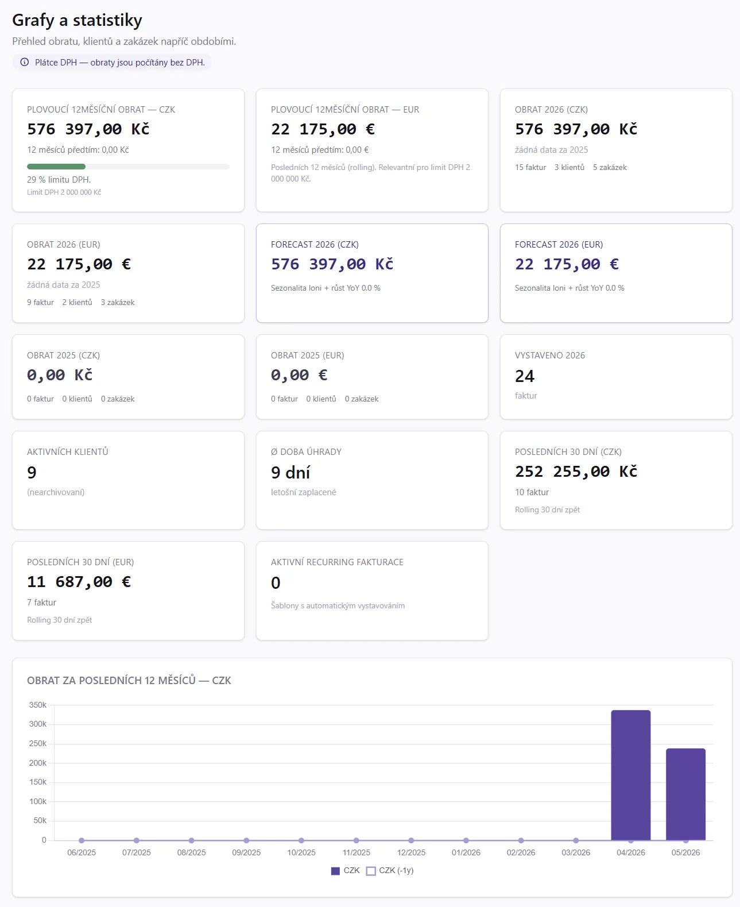

# 23. CRM dashboard

CRM (Customer Relationship Management) v MyInvoice.cz je BI/analytický modul nad tržbami, náklady a klienty. Najdeš ho v menu **Finance → CRM**.

> [!IMPORTANT]
> CRM nahrazuje předchozí stránku **Grafy** (přejmenovaná na **Tržby** v menu). Tržby zůstanou pro jednoduchý revenue overview; CRM rozšiřuje o náklady, zisk, aging, koncentraci, churn a další.
>
> 

## Co CRM zobrazuje

### KPI karty (top of dashboard)

- **Tržby tento měsíc** — z vydaných faktur (status ∈ issued/sent/reminded/paid, ne proformy)
- **Náklady tento měsíc** — z přijatých faktur (status ∈ received/booked/paid)
- **Zisk** — tržby − náklady (s color coding: zelený pokud kladný, červený jinak)

Plus trend % vs minulý měsíc (▲/▼) a YTD totals.

### Monthly trend chart

Bar chart pro posledních 12 měsíců:
- Zelený bar = tržby
- Červený bar = náklady
- Pravý sloupec = zisk per měsíc (s ↑/↓ indikací)

### Top klienti + Top vendoři

Pareto ranking — kdo dělá nejvíc revenue, kdo největší náklady. Včetně **percent_share** (jaký % z celkového objemu daného currency).

### Pohledávky a závazky (Aging buckets)

Distribuce nezaplacených faktur do skupin:
- **V termínu** (still not due)
- **1-30 dní po splatnosti**
- **31-60 dní**
- **61-90 dní**
- **90+ dní** (red)

Pro vystavené (pohledávky) i přijaté (závazky), per currency.

### Health metrics

- **DSO (Days Sales Outstanding)** — průměrná doba inkasa (paid_at − issue_date) za posledních 12 měsíců
- **Platební morálka** — % faktur zaplacených včas vs po splatnosti
- **Riziko koncentrace** — kolik % tržeb dělá Top 1 klient + risk level (low <25%, medium <40%, high >40%) + Pareto count (kolik klientů dělá 80%)

### Náklady podle kategorií

Pie chart (nebo bar) s rozpadem nákladů per `expense_categories`. Pokud nemáš kategorie přiřazené, vidíš jeden bar "Bez kategorie" — doporučujeme přiřadit (Číselníky → Kategorie nákladů).

### Churn risk

Klienti, kteří **60+ dní nemají objednávku**. Pro každého: poslední faktura, počet dní bez objednávky (color coded: >180 red, >90 warning), kumulativní revenue. Click na klienta → /clients/{id}.

## Filtry

- **Period**: 3 / 6 / 12 / 24 měsíců zpět
- **Currency**: pokud máš víc měn, picker (default první)
- **Recompute** (admin only) — manuální trigger `sp_recompute_crm_monthly_summary` (typicky není potřeba, cron běží denně, ale po importu většího batche faktur může pomoct hned aktualizovat)

## Jak data fungují

CRM čte z `crm_monthly_summary` — pre-agregovaná tabulka (per supplier + period_ym + currency) s totals (revenue, costs, vat_output, vat_input, counts). Refresh:
- **Automaticky**: stored procedura `sp_recompute_crm_monthly_summary(supplierId)` přes nightly cron
- **Manuálně**: tlačítko "Přepočítat" v topbaru (admin)

Některé metriky (aging, churn, DSO) jsou **live queries** z `invoices` / `purchase_invoices` (nepoužívají cache) — vidíš okamžitě aktuální stav.

## Tipy pro lepší přehled

1. **Přiřazuj expense categories** k přijatým fakturám → Náklady podle kategorií ukáže smysluplný rozpad
2. **Plnit VAT klasifikační kódy** (auto-default už řeší 99% případů) → DPH report v sekci Daně bude přesnější
3. **Vyrovnávat bank statements** → DSO bude přesné (paid_at = datum úhrady)
4. **Pravidelné faktury** (`/recurring`) — predikovatelné MRR, plánujeme zobrazit v dalším iter
