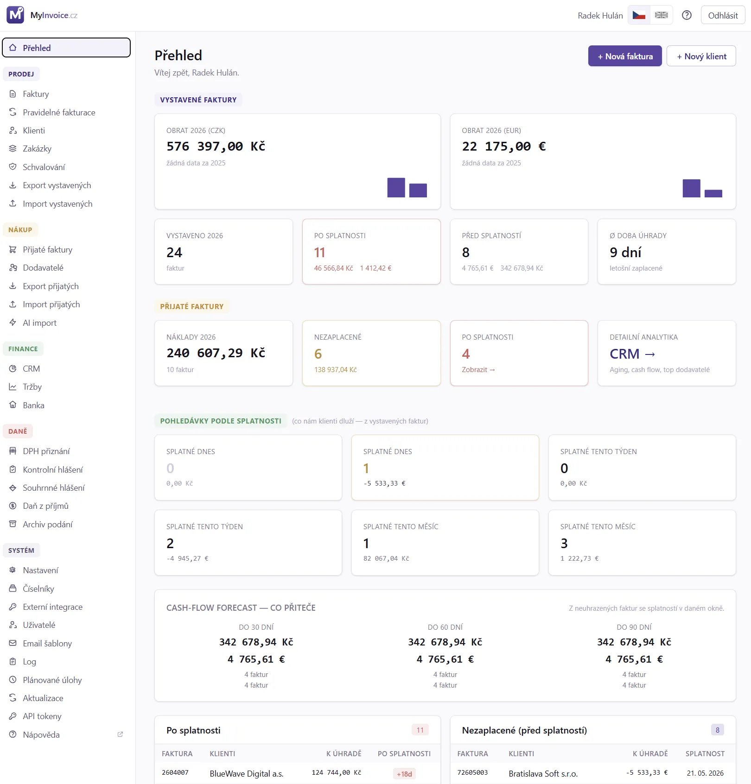

# MyInvoice.cz — uživatelský manuál

[🌐 MyInvoice.cz](https://myinvoice.cz/) · [⭐ GitHub](https://github.com/radekhulan/myinvoice) · [📦 GHCR Docker](https://github.com/radekhulan/myinvoice/pkgs/container/myinvoice)

> Verze: 4.0.0 · Datum: 2026-05-22 · Vyvíjí [MyWebdesign.cz s.r.o.](https://mywebdesign.cz/)

Vítej v manuálu k fakturačnímu systému **MyInvoice.cz**. Manuál pokrývá vše, co
v aplikaci uděláš — od prvního přihlášení, přes vystavení faktury a její
odeslání e-mailem, import bankovního výpisu, upomínání po splatnosti, až po
exporty pro účetní software.

První kapitola **Instalace** je technická (cílí na osobu, která systém
nasazuje). Zbytek je psaný pro běžného uživatele — bez programátorského
žargonu.

---

### Začínáme

1. [Úvod — co MyInvoice.cz umí](01_Uvod.md)
2. [Instalace (Docker / nativní)](02_Instalace.md)
3. [První spuštění (setup wizard)](03_Setup_wizard.md)
4. [Přihlášení a uživatelský profil](04_Prihlaseni.md)
5. [Přehled (dashboard)](05_Prehled.md)
6. [Fakturujeme — daňový průvodce (plátce/neplátce, DPH, RC, OSS)](06_Fakturujeme.md)

### Práce s daty

7. [Klienti](07_Klienti.md)
8. [Zakázky (vč. schvalování výkazů zákazníkem)](08_Zakazky.md)
9. [Faktury — seznam a hromadné akce](09_Faktury.md)
10. [Přijaté faktury (nákupy)](10_Prijate_faktury.md) — nové ve v3.5.0
11. [Faktura — editor, výkaz víceprací a schvalování zákazníkem](11_Faktura_editor.md)
12. [Faktura — PDF, QR platba, odeslání e-mailem](12_Faktura_PDF.md)

### Platby a komunikace

13. [Banka — import výpisů a párování plateb](13_Banka.md)
14. [Upomínky po splatnosti](14_Upominky.md)
15. [Pravidelné fakturace (recurring invoices)](15_Pravidelne_fakturace.md)

### Exporty pro účetní

16. [Exporty (PDF ZIP, ISDOC, Pohoda XML)](16_Exporty.md)
17. [Importy (Pohoda XML, ISDOC)](17_Importy.md)

### Konfigurace

18. [Více dodavatelů z jedné instalace](18_Multi_supplier.md)
19. [Nastavení (dodavatel, číselníky, uživatelé, e-mail šablony)](19_Nastaveni.md)
20. [Bezpečnost (2FA, IP allowlist, role, activity log)](20_Bezpecnost.md)
21. [Aktualizace na novou verzi](21_Aktualizace.md)

### Pokročilé

22. [REST API (automatizace a integrace)](22_API.md)
23. [CRM dashboard (revenue/costs/profit/aging/DSO)](23_CRM.md) — **nové ve v4.0.0**
24. [Výkazy DPH (DPHDP3 + KH + SH)](24_Vykazy_DPH.md) — **nové ve v4.0.0**
25. [Daň z příjmů (DPFO / DPPO)](25_Dan_z_prijmu.md) — **nové ve v4.0.0** (MVP foundation)

### Reference

99. [Řešení problémů (FAQ)](99_Reseni_problemu.md)
